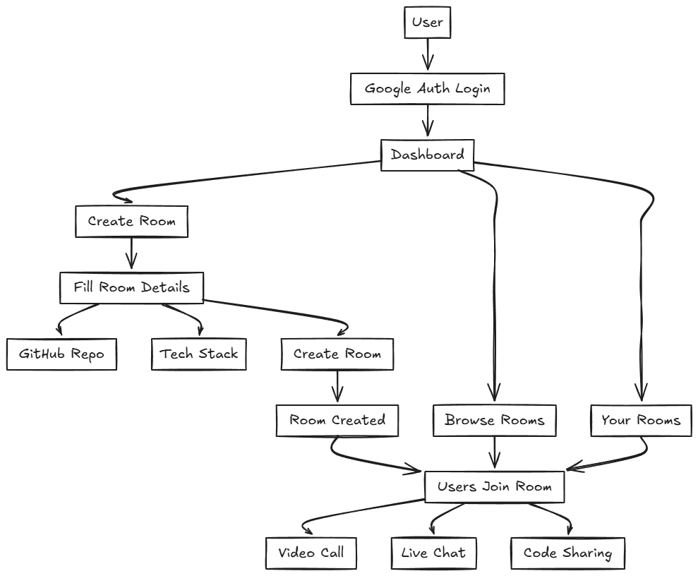

# Devfinder

Devfinder is a **peer-to-peer (P2P) collaboration platform** for developers to connect, code, and solve bugs together in real-time. Users can create or join rooms, share their screen, talk via video calls, and collaborate on togther by providing issue at room creating by linking githubrepo link and languages as a tag they used in repo.

---

## Features 

*  **Peer-to-Peer Rooms**: Secure, temporary rooms to pair program or debug together by creating or joining rooms by providing github repo.
*  **Video & Screen Sharing**: Built with getstream.io api for video and screen share connection .
*  **Real-Time Collaboration**: Collaborate with developers from around the world and paircode with other .

---

## Getting Started 

Clone the repository:

```bash
git clone https://github.com/Anantdadhich/Devfinder
cd Devfinder
```

Install dependencies:

```bash

npm install

```
Run the development server:

```bash
npm run dev

```

Setup Prisma  

npx prisma  generate  
```bash 

npx prisma generate  
npx prisma db push

```
Setup your .env 

```bash
DATABASE_URL=""
NEXTAUTH_SECRET=""
NEXT_PUBLIC_GET_STREAM_API_KEY=""
NEXT_PUBLIC_GET_STREAM_SECRET_TOEKN=""
GET_STREAM_SECRET_KEY=""
NEXTAUTH_URL="http://localhost:3000/"
GOOGLE_CLIENT_ID=""
GOOGLE_CLIENT_SECRET=""

```

---

## Architecture 



---

## Tech Stack
- Next.js

- TypeScript 

 - GetStream 

 - Prisma ORM 

- NextAuth.js 

- Neon.tech 


---
## Sreenshot

 ! [alt text](dev.png)
 

---

## License 

[MIT](LICENSE)

---

Built with ❤️ by Adtech
